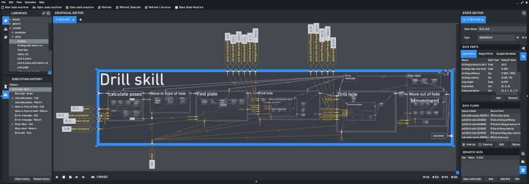

RAFCON
======

* Documentation: Hosted on `Read the Docs <http://rafcon.readthedocs.io/en/latest/>`_
* Homepage: `DLR-RM.github.io/RAFCON/ <https://dlr-rm.github.io/RAFCON/>`_
* License: `EPL <https://github.com/DLR-RM/RAFCON/blob/master/LICENSE>`_

Develop your robotic tasks using an intuitive graphical user interface
----------------------------------------------------------------------

RAFCON uses hierarchical state machines, featuring concurrent state execution, to represent robot programs.
It ships with a graphical user interface supporting the creation of state machines and
contains IDE like debugging mechanisms. Alternatively, state machines can programmatically be generated
using RAFCON's API.

Universal application

  RAFCON is written in Python, can be extended with plugins and is hard- and middleware independent.

Visual programming

  The sophisticated graphical editor can be used for the creation, execution and debugging of state machines.

Collaborative working

  Share and reuse your state machines in form of libraries, stored as JSON strings in text files.

.. figure:: https://raw.githubusercontent.com/DLR-RM/RAFCON/master/documents/assets/RAFCON-sm-creation-preview.gif
   :figwidth: 100%
   :width: 570px
   :align: left
   :alt: Example on how to create a simple state machine

Installation preparations
-------------------------

Before installing RAFCON, Python >=3.7, pip and setuptools are required on your system. Most of the other dependencies
are automatically resolved by pip/setuptools, but not all of them. Those need be be installed manually, too:

Installation requirements
^^^^^^^^^^^^^^^^^^^^^^^^^

.. code-block:: bash

   sudo apt-get install python-dev python-pip build-essential glade python-gi-cairo
   sudo -H pip install --upgrade pip
   sudo -H pip install --upgrade setuptools

General requirements
^^^^^^^^^^^^^^^^^^^^

* Python >=3.7
* pip (recent version required: v23 known to be working)
* pdm (recent version required: v2.9.3 known to be working)

Installing RAFCON
-----------------

.. code-block:: bash

   pip install rafcon --user

The ``--user`` flag is optional. If not set, RAFCON is installed globally (in this case you normaly need to have root privileges).

If during the installation the error ``ImportError: No module named cairo`` occurs, please install pycairo directly
via:

.. code-block:: bash

   pip install --user "pycairo==1.19.1"

Of course you can also directly use the RAFCON sources from GitHub.

.. code-block:: bash

   cd /install/directory
   git clone https://github.com/DLR-RM/RAFCON rafcon

Start RAFCON
------------

No matter which installation option you choose, RAFCON can be started from any location using (make sure
``/usr/local/bin`` or ``~/.local/bin`` is in your ``PATH`` environment variable):

.. code-block:: bash

   rafcon

On a multi-python setup start rafcon using:

.. code-block:: bash

   python<your-version> -m rafcon

Uninstallation
--------------

If you want to uninstall RAFCON, all you need to do is call

.. code-block:: bash

   pip uninstall rafcon
