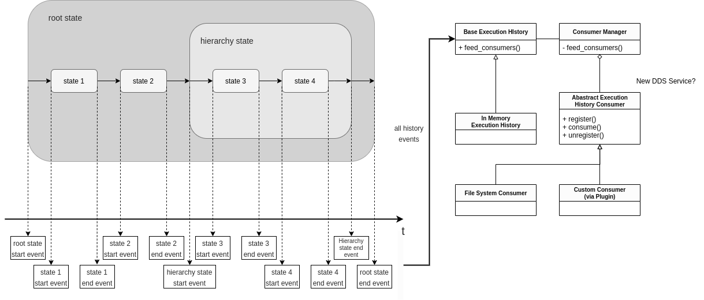

Concepts
========

A state-machine in :ref:`RAFCON` consists of states connected with transitions.
In addition to this logical flow, RAFCON introduces what is called a
data flow. This allows data to be directly shared between states.

States
------

A state does not represent a state of the system, but a state in task flow. Usually a state executes
some action or calculates some result and finally return an outcome.
States can have an arbitrary number of input ports and output
ports. There are different types of states:

The simplest type of state is called **Execution state**. An execution
state includes an ``execute`` function that is run when the
corresponding state is entered. The parameters of the function are
references to the input and output data as well as to the global
variable manager. The return value of the ``execute`` function
determines the outcome of a state.

A **Hierarchy state** is one kind of container state. It groups one or
more child states (which can be containers themselves). In addition to
the input and output ports, hierarchy states can have scoped variables.
Hierarchy states do not have an ``execute`` function, they are just means to encapsulate other states.

**Concurrency states** are also container states. They allow for the parallel execution of two or more
states. All direct children are executed in parallel in different
threads. Parallel executing states cannot exchange data using data
flows, but have to use global variables with the global variable
manager. Global variables are thread safe. There are two types of concurrency to be distinguished:

**Barrier concurrency states** wait for all parallel executing states to
finish. After all child states are finished a special **Decider** state is called.
This state decides upon the final outcome of the barrier state itself.

**Preemptive concurrency states** can have several outcomes. The first
parallel executing state that finishes determines the outcome and forces
all other states to preempt.

A special type of states are **Library states**. These states cannot be
edited within a state-machine, but are predefined. A library state is a
state-machine itself and can internally consist of arbitrary states and
hierarchies (even further libraries). Every state-machine can be
converted to a library and thus be reused in other projects. Libraries
can be parameterized like any other state with input ports and return
values/results on output ports.

Outcomes
--------

Outcomes can be described as "exit points" of states. Every state has at
least two outcomes, "aborted" and "preempted". In addition to these
special outcomes, every state can have an arbitrary number of additional
outcomes with individual names ("success", ">=0", "yes", ...). Each
outcome has an id. For "aborted" it is -1 and for "preempted" it is -2.
Further outcomes have increasing numbers starting from 0. Depending on
the type of the state, the outcome on which the state is left is
determined in different ways:

-  For execution states, the user determines the outcome by returning
   its id at the end of the ``execute`` function. If the returned id is
   not existing, this is treated as an error and the state is left on
   the "aborted" outcome. Errors and exceptions in general force a state
   to be left on the "aborted" outcome.

-  For hierarchy states, the child states together with the transitions
   determine the outcome. As soon as during the execution of a hierarchy
   state a transitions leads to an outcome of the hierarchy state, the
   state is left on this outcome. However, if an exception or error
   occurs in a child state, which is not caught (by connecting the
   "aborted" outcome of the erroneous state), the hierarchy state is
   left also on the "aborted" outcome. By this, errors and exception
   climb up the hierarchy, until an "aborted" outcome is connected or
   the root state is reached (and the program stops).

-  The situation for preemptive concurrency states is similar to that of
   hierarchy states. A triggered transition to an outcome causes the
   state to be left on that outcome. In addition, all parallel states
   are left (from the innermost running state upwards) on the
   "preempted" outcomes. This allows states to ensure a safe and
   consistent state when being forced to stop.

-  Barrier concurrency states are special in that the Decider is responsible for the final outcome.
   This state decides based on the outcomes of the parallel child states and the output data of the child states
   the final outcome of the barrier state.

Transitions
-----------

Transitions connect outcomes and states (or other outcomes). They do not
have a name and or any further data. Every outcome should be connected
with a transition, which is connected to another state (there is only
one "entry point" per state, where several transition can be connected
to). In container states (hierarchy or concurrency states) transitions
can also be connected from a outcome of child state to another outcome of the parent
state. This causes the execution flow to leave the hierarchy at that
point. There may only be one transition per outcome.

Data ports
----------

Data ports are the equivalent to outcomes, but on the data flow level
(in contrast to the logical flow). Data ports have a name, a type and a
default value. There are two types of data ports, input data ports and
output data ports (from hereon called inputs and outputs). Every state
can have an arbitrary number of inputs and outputs, which are used to
pass data in and out.

Inputs can be compared to parameters of a function. In our case, the
function is the state. A state defines which data it needs to calculate
its output or to execute some action. The data fed to input ports is
passed to the ``execute`` function of execution states. It is the first
parameter of type ``dict`` and the names of the inputs as keys. If no
data flow is connected to an input, then the default value is used as
its value.

Accordingly, outputs are the return values of states. Similar to Python
functions, states cannot only return one value, but arbitrarily many (or
none). The outputs are also passed to the ``execute`` function of
execution states. It is the second parameter, also of type ``dict``.
The function can set the value of each output by assigning a value to
the according dictionary entry. If no value is set, the default value is
used for the further execution.

It is important to note that the input values used are passed by value
and this value is created as deep copy either from the value coming from
the data flow or the default value. As a consequence, complex values (e.
g. dictionaries) calculated by one state, which are fed to two different
states, can be modified in one state without the other state seeing this
modification. One state can be executed several times when being in a
loop and always gets new input data.

The data types of individual data ports can be of standard python
built-in data types (e.g. int, float, long, complex, str, unicode,
tuple, list, dict, bool). They can also be of types defined by
third-party packages, as long as the packages lie in the PYTHONPATH
environment variable (e.g. numpy.ndarray).

Scoped variables
----------------

Scoped variables only exist in container states and have a name, type
and default value (just like data ports). They can be seen as kind of
variable or data port, from which every child state can read from and
write to. Thus, they can for example be used as data storage for states
being executed several times (using loops).

Data flows
----------

Data flows are for data ports (and scoped variables) what transitions are
for outcomes. Just as transitions, they neither have a name nor hold any
further data. They define the flow of data, typically from outputs (sources) to
inputs (sinks). However, it is not as simple as that. In the case of container
states, a data flow can go from the input of the container state to the
input of a child state (feeding data down in the hierarchy). Similarly,
data flows can go from the output of a child to the output of its
container state (feeding data out/up the hierarchy).

In addition, inputs can receive (read) data from scoped variables and
outputs can pass data (overwrite) to scoped variables. A container input
can write to a scoped variable as well as the scoped variable can write
to an output of its container.

A port (input, output, scoped variable) can serve both as source and of
sink of data flows for arbitrary many other ports.

Global Variable Manager
-----------------------

The Global Variable Manager (GVM) allows to store values globally. The
GVM is thread-safe, thus you can access variables from in parallel
running states. The GVM is intended for variables, which are needed in
many states within different containers, such as constants, global
parameters, etc. or for global objects, such as a middleware client. You should
not abuse the GVM as a general replacement for data ports and data
flows. Actually, modelling parameters via data flows has huge advantages:
It enables easy encapsulation and reuse of your states, makes your state machines
easy to understand and can be nicely logged in the execution history
(which also can be analyzed after execution).

The ``execute`` function of Execution States retrieves a reference to
the GVM as its third parameter after ``self``. Variables are set using
``set_variable(self, key, value, per_reference=False, access_key=None)``.
Parameter ``key`` is the name of the variable, ``value`` is
the (new) value. If the variable is not existing, it is created,
otherwise the value is overwritten. If you only want a reference to be
stored, set ``per_reference`` to ``True``, otherwise a deep copy is
created. If the variable is locked, you have to specify the
``access_key`` to temporary unlock it, otherwise a ``RuntimeError`` is
raised.

To read the value of a variable stored in the GVM, use
``get_variable(self, key, per_reference=False, access_key=None, default=None)``.
The ``key`` is again the name of the variable. If it is not existing,
the value specified by the ``default`` parameter is returned. If you
only want a reference to the value, set ``per_reference`` to ``True``.
This is only possible for variables, whose value was stored by
reference. Again a ``RuntimeError`` is raised in case of a failure.
Specify the ``access_key``, in case the variable is locked, otherwise a
``RuntimeError`` is raised.

Variables can be locked to prevent access from other states. To do so,
call ``lock_variable(self, key)`` and specify the variable name with
``key``. The access key is returned, which is needed to unlock the
variable again with ``unlock_variable(self, key, access_key)``.

Often, you will want to pass the value of a variable stored in the GVM
to an input port. For this, a short-hand method was introduced. All you
have to do is setting the default value of the input port to $key, where
key is the name of the variable. If the variable is not existing, the
port value is set to ``None``.

You can see the current variables of the GVM and their values in the
left-hand side of the GUI. There you can also create new variables.
However, variables are not stored when saving state-machines. If you
want to have variables loaded with the state-machine, you have to create
those variables in an initial execution state.

Execution History
-----------------

The general idea of the execution history is shown in the following figure:

During execution, a start and an end event is created for each state.
Subsequently, the events are forwarded via the ExecutionHistory
(in case the IN_MEMORY_EXECUTION_HISTORY_ENABLE is enabled, the InMemoryExecutionHistory is used)
to the ConsumerManager. The ConsumerManager distributes the events to different Consumers.
RAFCON ships with a default Consumer called the FileSystemConsumer.
If FILE_SYSTEM_EXECUTION_HISTORY_ENABLE is enabled the FileSystemConsumer will write all history on disk into a shelve file.
The execution_log_viewer.py can then be used to analyze the execution history logs after runtime.

It is straightforward to create other consumers (e.g. for logging the execution-history via a middleware).
Therefore, a plugin can be created that just works similar to the FileSystemConsumer.
For writing a plugin, only the "pre_init" and the "register_execution_history_consumer" hook has to be created.
The latter one has to care about that the consumer is registered at the ExecutionHistoryConsumerManager.
