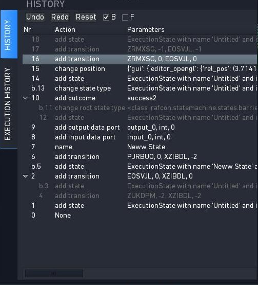

GUI Guide
=========

The following shows a common guide for the :ref:`RAFCON`-GUI.
The page contains advises about how to use the widgets
effectively.

Left Pane
---------

Library Tree widget
"""""""""""""""""""

The Library tree shows all libraries mounted via the LIBRARY\_PATH defined
in your configuration file, see :ref:`Configuration`. Sub-library paths unfold
and fold by double-click. Double-clicking on a library opens the library in the graphical editor.
A right-click on the row of a library element opens a menu with the
options "Add as Library", "Add as template", "Open" and "Open and run".
"Add as template" pastes a fully editable copy of the respective library into the
actual selected state (as long as selected state is a ContainerState).

The Library Tree can be reloaded by pressing the the "Refresh Libraries"-Button in the Menu-Bar or Tool-Bar.

State Machine Tree widget
"""""""""""""""""""""""""

The State Machine Tree (or "State Tree") shows all states that are in
the actual selected state-machine, its state\_id and the type of the
state. A state is selected if the respective row is selected and the
row of a state becomes selected if the state becomes selected by another
widget e.g. the graphical editor.
A selected state can be removed by pressing the delete-shortcut
or a state can be added into a selected state/row by pressing the
add-shortcut. See :ref:`Configuration` to define those shortcuts.

Global Variable Manager widget
""""""""""""""""""""""""""""""

The Global Variable Widget shows all existing global variables, their
names, values and if they are locked. The name and value can be edited
by clicking into the respective fields and "shift-tab", "tab", and the "arrow-keys" can
be used to move throw the editable columns and variables. Press Enter or
move by using "shift-tab" or "tab" to confirm the modification of a specific
element. A selected global variable can be removed by pressing the
delete-shortcut or a variable can be added by pressing the add-shortcut. See
:ref:`Configuration` to define those shortcuts.

Modification History widget
"""""""""""""""""""""""""""

The history is implemented as a tree of actions. Therefore a trail history view (list)
and a branch history view (tree) are possible. The actual used
representation is the branch history view, see figure.

In the top (below the label "HISTORY") the edit history widget has three
buttons for "Undo/Redo" of actions and "Reset" of the history. The reset
deletes all history tree elements recorded so far. "Undo" and "Redo"
also can be performed by using the shortcuts strg-z and strg-y as usual.

The view also can be modified by the disabling of the branch-history
view (trail-history-view becomes active) using the check-button labeled
"B" or by only enabling automatic folding of the not used branches by
check-button "F".

In the figure it can be seen that the trail history element with number
16 is selected (grey). Every number/id is one step of the state
machine edit process that has been recorded. Action with the number 16
used the method "add transition" and connects two states with the IDs
ZRMXSG and EOSVJL. Elements 17-18 are undone and thereby are labeled
gray. All elements in the trail history from 0 to 16 are in use, so
labeled white. All elements on a previous used branch but not active
branch are also labeled grey, see Nr 11-12 and 3-4.

By selecting a specific element in the list/tree the version after this
action is recovered. To jump to the initial situation of the state
machine when the record of edit history started the user has to click
element 0 which is labeled by action "None".

Execution History widget
""""""""""""""""""""""""

In the execution history widget all runs of the currently selected state
machine are visualized in a tree like structure. This can be used for
debugging purposes as also all the context data of each executed state
is visualized. The execution history can also be logged to disk.
(see the logging variables in the :ref:`Core configuration`)

Center Pane
-----------

Graphical State Machine Editor widget
"""""""""""""""""""""""""""""""""""""

There are two different graphical editors for editing a state machine.
The current graphical editor uses the Python library "Gaphas".
The alternative graphical editor uses OpenGL for hardware acceleration with the graphics card.
The :ref:`Configuration` explains how to switch between the two editors.

The Gaphas graphical editor is more advanced than the OpenGL one (and
also much more pleasant to look at ;-) ).
There are some shortcuts, which you should be aware of:

-  Zoom: Mouse scroll wheel
-  Panning: Middle mouse button
-  Move ports (along border of state): Ctrl + click and move cursor (select the state of the port beforehand)
-  Move name of state: Ctrl + click and move cursor
-  Resize state with content: Ctrl + click on corner handles
-  Operations on the selected state: Right mouse button (opens context
   menu)
-  Add new Execution State to selected state: Alt + E
-  Add new Hierarchy State to selected state: Alt + H, Ctrl + Shift + A

You can also drag'n'drop states into the editor. This is possible from
the four "+ \*S" buttons below the editor and from the libraries widget.

Debug Console widget
""""""""""""""""""""

The Debug Console can be found below the Graphical Editor. All messages
will be displayed in it, whereas the type of the displayed messages can
be filtered with the checkboxes on top of the console. As for the other
widgets, the Debug Console can be unpinned by clicking the symbol in
the upper right corner. A right-click into the console opens a menu
providing the options to ``"Copy"`` selected output, ``"Select All"``
output or ``"Clear Logging View"``.

Right Pane (States Editor)
--------------------------

The right sidebar shows the "States Editor". It can show several tabs,
but by default, only the selected state is shown. However, you can *pin* a state tab
by clicking on the needle icon within the tab.

The number within the tab shows the state machine id belonging to the
state.

Every "State Editor" consists of the three widgets described below: The
State Overview, State content (with widgets for the Source Editor, Logical Linkage and Data Linkage)
and State Linkage Overview (with widgets for the Description and Semantic Data).

State Overview widget
"""""""""""""""""""""

The State Overview can be found directly under the "STATE EDITOR"
headline. It provides the name of the selected state, which can be
edited by clicking on it, and the fixed state ID. Additionally, the
State Overview contains a dropdown menu, where the type of the state can
be changed, and a checkbox which marks a state as start state.

Source Editor widget
""""""""""""""""""""

The Source Editor is the first tab of the notebook in the middle. It is
a editor with the three buttons "Apply" to save the file, "Cancel" to
discard changes and "Open externally" to open the file in an external editor.

Logical Linkage widget
""""""""""""""""""""""

By clicking the middle tab of the center notebook, the sub-widgets
Outcomes and Transitions, which represent the logical linkage of a state, can be reached.
In the Outcomes widget the outcomes of the selected state are listed.
It consists of the columns "ID", "Name" and "To-State".
If the "To-State" is a hierarchy state the "To-Outcome" of the "To-State" is also shown.
Next to the obligatory IDs "0", "-1" and "-2", it is possible to append own
outcomes by clicking the "Add" button. A click on the "Remove" button
will delete the selected outcome.

The Transitions sub-widget lists the transitions between the selected
state and its siblings (or parent). There are the four columns: "Source State", "Source Outcome", "Target
State" and "Target Outcome". With the buttons "Add" and "Remove",
additional transitions can be added and selected ones can be deleted.

Data Linkage widget
"""""""""""""""""""

The Data Ports and Data Flows sub-widgets, which represent the data linkage of a state,
can be accessed by clicking oon the last tab of the middle notebook.
Within the Data Ports sub-widget it is possible to change between "Input Ports" and "Output Ports". The
currently selected one is highlighted in blue. Input and output ports
works like function parameters. They consists of a "Name", a "Data Type"
and a "Default Value". A click on the button "New" appends a
new port, the button "Delete" removes the selected port.
If the selected state is a container state, then also a tab for "Scoped Variable" emerges.

Similar to the transitions, the data flows of a state are shown in the lower part.

Data and Logical Linkage widget
"""""""""""""""""""""""""""""""

A quick overview of all data ports and outcomes of the selected state.

State Description widget
""""""""""""""""""""""""

The State Description sub-widget can be reached by clicking the second
tab of the lower notebook. It is an editor, where comments or a
description can be placed.

Semantic Editor widget
""""""""""""""""""""""

In this widget the semantic data of a state is shown and can be edited in a tree like data structure.
