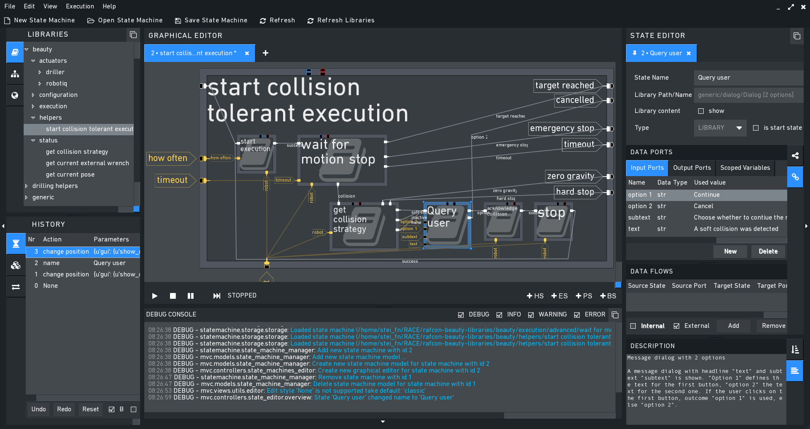

.. figure:: _static/RAFCON_Logo_Farbe_RGB.png
   :alt: Official RAFCON logo
   :width: 90 %
   :align: center

RAFCON
======

**Develop your robotic tasks using an intuitive graphical user interface**

RAFCON (**R**\ MC **a**\ dvanced **F**\ low **Con**\ trol) uses hierarchical state machines, featuring
concurrent state execution, to represent robot programs. It ships with a graphical user interface supporting the
creation of state machines and contains IDE like debugging mechanisms. Alternatively, state machines can
programmatically be generated using RAFCON's API.

.. toctree::
   :maxdepth: 1
   :numbered: 2
   :caption: Table of Contents

   concepts.rst
   getting_started.rst
   changelog.rst
   tutorials.rst
   building_docs.rst
   configuration.rst
   autobackup.rst
   gui_guide.rst
   plugins.rst
   faq.rst
   development/development.rst
   api/rafcon.rst

Indices and tables
==================

* :ref:`genindex`
* :ref:`modindex`
* :ref:`search`

