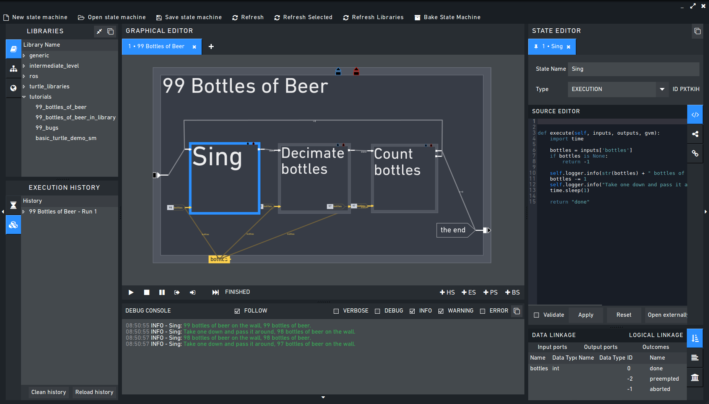
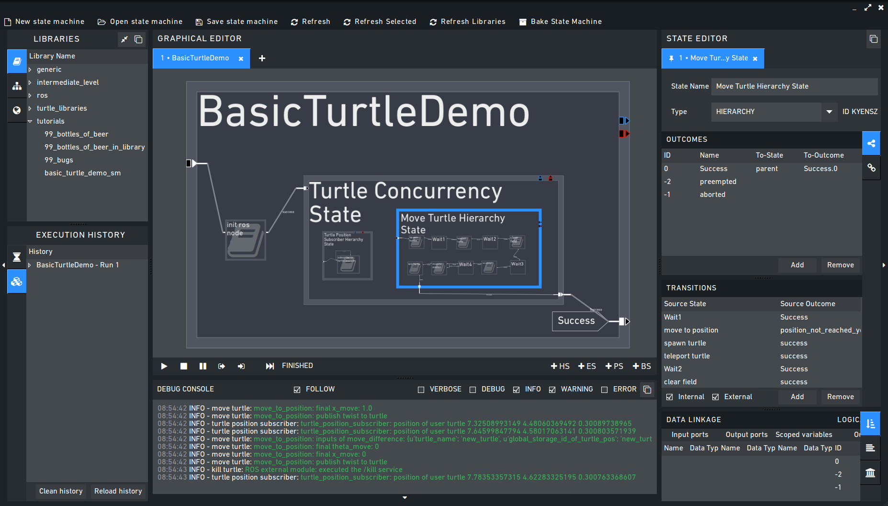
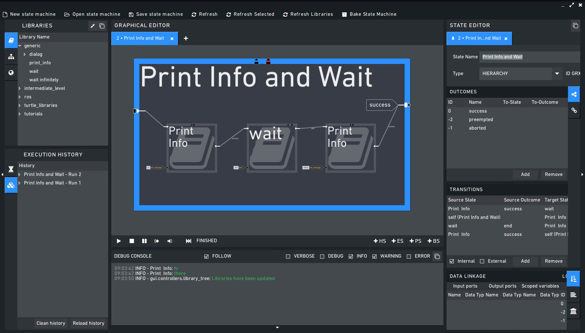
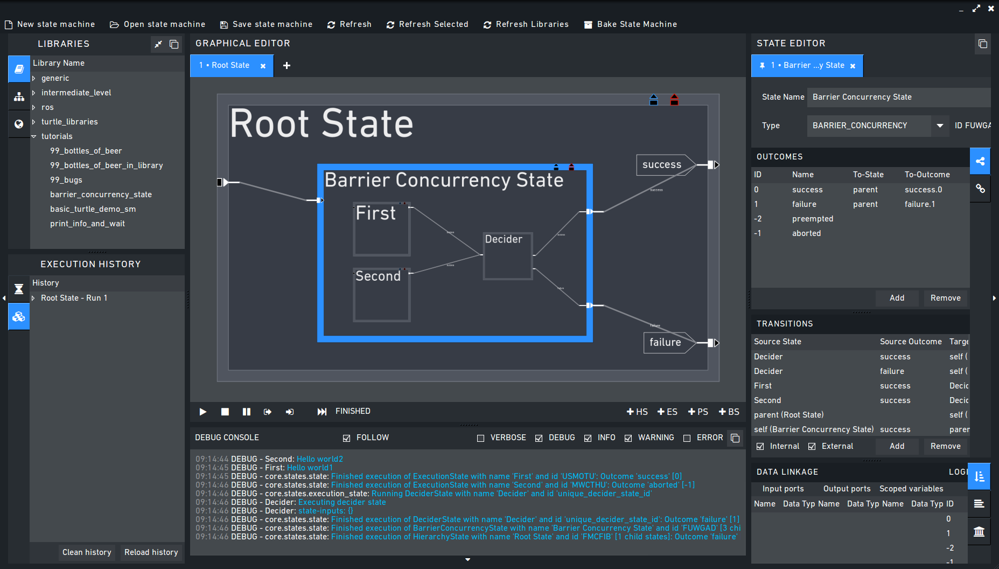

Tutorials
=========

.. _tutorial_bottles_of_beer:

99 Bottles of Beer. Or: How to create a simple state machine containing a loop
------------------------------------------------------------------------------

In this tutorial we create a
simple state-machine printing the lyrics of "99 Bottles of Beer", a
`slightly advanced version of a Hello World
program <http://en.wikipedia.org/wiki/99_Bottles_of_Beer#References_in_science>`__.
The purpose is to give a first impression of how to create programs with
:ref:`RAFCON`, how to create loops and illustrate different ways
of achieving things in RAFCON.

#. Start with a new state machine (first button in the tool bar or File
   => New in the menu bar). A new tab opens with the root container
   state named "new\_root\_state".
#. Select the root state by clicking on it in the graphical editor (big
   center widget) or by opening the "State Tree" widget (left hand side)
   and clicking on the state here.
#. Now we change the name of the root state to "99 Bottles of Beer" by
   entering that text in the input field next to "State Name" in the
   State Editor on the center site. Here you can also see all other
   properties of our container state.
#. Now we are going to create three execution states named "Sing",
   "Decimate bottles" and "Count bottles". Do so by selecting the
   container state first and then either use +A or Edit > Add state in
   the menu bar. Rename each new state as described in the previous
   step.
#. You can use drag and drop for the three child states to place them
   next to each other. Using the lower center corner of all states, you
   can resize them. When holding during the resize, the state keeps its
   width to height ratio. When holding during the resize (of container
   states), all content is resized with the state.
#. Next, we are going to add the logical flow, that is the outcomes and
   transitions. "Sing" and "Decimate bottles" each need one outcome,
   which should exist by default. For "Count bottles", we need two
   outcomes, the first (ID 0) is named "==0", the second (ID 1) is named
   ">0". Click on the state to open it in the State Editor and open the
   "Logical Linkage" widget on the bottom. In the upper half of this
   widget, you can edit the state's outcomes. Create an additional
   outcome by clicking on "Add" or using +A if the outcomes list has the
   focus. Then name the new outcomes (by clicking on the name in the
   name column). Also the container state needs an outcome, name it "the
   end".
#. To finish the logical flow, we set up all transitions and start
   states. "Sing" is the start state of our only container (the root).
   Thus click on it and check "is start state" in the top of the State
   Editor. This creates a transition from the entry point of the root to
   the entry point of "Sing". The easiest way to create the remaining
   transitions is to first click on an outcome and then click on the
   target state. This creates a transition starting from the outcome and
   going to the entry point of the state. The starting transition can be
   created in the same manner. You can set transition waypoints in
   between by clicking on the desired position within the container
   while creating the transition. Later, you can add/remove waypoints by
   clicking on the desired position of the transition. By this, you can
   e. g. draw transitions around other states. Another possibility to
   create transitions is the State Editor again. In the lower half of
   the Logical Linkage widget, new transitions can be created by a click
   on "Add" (or using +A if the focus is on the transition list). The
   widget tries to guess on which transition to create, but you can edit
   the origin and target by clicking on the field in the appropriate
   column. We need four transitions. One from "Sing" to "Decimate
   bottles", then one from "Decimate bottles" to "Count bottles", one
   from "Count bottles" outcome ">0" back to "Sing" and finally one from
   "Count bottles" outcome "==0" to "the end" of the container.
#. In this step we are going to create the data ports and scoped
   variables. For printing the verse, our "Sing" state needs the current
   number of bottles as input. Therefore we create an input data port.
   Select the "Sing" state and open the "Data Linkage" widget in the
   State Editor. The ports are handled in the upper half of this widget.
   First select the "Input Ports" tab and then create an input by
   clicking on the "New" button. Set the name to "bottles" and the type
   to "int". We do not need a default value here (the default is
   automatically "None"). "Decimate bottles" needs an input and an
   output port to read in the current number of bottles and to return
   the new number of bottles. Thus, create the two ports, both named
   "bottles" and both of type "int" (again no default values). "Count
   bottles" also needs only an input port of type "int" and name
   "bottles".
#. In order to hold data between the loop iterations, we need a scoped
   variable. This variable is defined in the container state. It is
   created analogous to inputs and outputs, just in the "Scoped
   Variables" tab. Name and type are again "bottles" and "int". Here we
   set the default value, which is also the initial value, to 99. Scoped
   variables can be moved in the graphical editor just like states with
   drag and drop.
#. The data flows are now created similar to the transitions. Either in
   the graphical editor by clicking on the origin port (from where to
   read) and then clicking on the target port (to where to write) or,
   alternatively the bottom half of the Data Linkage widget can be used.
   Create the following data flows:

   #. From the scoped variable to the input of "Sing": Here we are
      reading the current number of bottles
   #. From the scoped variable to the input of "Decimate bottles": Here
      we are reading the current number of bottles
   #. From the output of "Decimate bottles" to the scoped variable: Here
      we are writing the decimated number of bottles back
   #. From the output of "Decimate bottles" to the input of "Count
      bottles": Here we directly pass the decimated number to "Count
      bottles". This could also have the scoped variable as origin.
   #. Instead of reading the second data flow, one could also add an
      output to "Sing", and write the read value from the input of
      "Sing". This output could then be used as origin for the second
      data flow.

#. Finally, we have to add some source code to the three child states.
   The code executed for each state is shown in the source code widget
   of the State Editor. The method description is automatically created.
   You just have to insert your code after the line
   ``def execute(...)``. Copy the code following at the end of the
   tutorial into the states. Important: You have to click on "Apply" to
   apply changes. The ``sleep`` statements in the code only serve
   illustrative purposes, better visualizing the flow of active states.
   You see that you can read from ports using the inputs dictionary
   (``bottles = inputs['bottles']``) and write to ports using the
   outputs dictionary (``outputs['bottles'] = inputs['bottles'] - 1``).
   You can also rename these dictionaries if you prefer a different
   (shorter) name: ``def execute(self, in, out, gvm):``. The logger is a
   member of each state and can be used to write to the logger window.
   You can use different logger levels (debug, info, warn, error).
#. You can now test the state-machine. Click on Execution > Start and
   see what happens. The current state should be highlighted and the
   verses printed in the logger widget. You can stop the execution with
   Execution > Stop. Alternatively, use the buttons shown in the menu of
   the Graphical Editor.

.. code:: python

    # State "Sing"
    def execute(self, inputs, outputs, gvm):
        import time   

        bottles = inputs['bottles']
        if bottles is None:
            return -1

        self.logger.info(str(bottles) + " bottles of beer on the wall, " + str(bottles) + " bottles of beer.")
        bottles -= 1
        self.logger.info("Take one down and pass it around, " + str(bottles) + " bottles of beer on the wall.")
        time.sleep(1) 

        return 0

.. code:: python

    # State "Decimate bottles"
    def execute(self, inputs, outputs, gvm):
        import time
        
        outputs['bottles'] = inputs['bottles'] - 1
        time.sleep(0.2)
        
        return 0

.. code:: python

    # State "Count bottles"
    def execute(self, inputs, outputs, gvm):
        import time
        
        time.sleep(0.2)
        
        if inputs['bottles'] > 0:
            return 1
        return 0

.. _tutorial_ros_turtle:

Starting the basic turtle demo statemachine using ROS
-----------------------------------------------------

The basic turtle demo is a demo to demonstrate the use of libraries and
to show the easy integration of `ROS <ROS>`__ into the RAFCON. To start
the turtle demo just change into the RAFCON directory and open the
basic\_turtle\_state\_machine (the following code blocks include code lines
to generate the correct environment in the shell before executing the commands
themselves; in an e.g. Ubuntu setup, where the environment is statically specified
in the ~/.bashrc these environment generating commands can be omitted):

.. code:: python

    rmpm_do env ros.indigo.desktop > /tmp/desktop.env
    source /tmp/desktop.env
    rmpm_do env rafcon > /tmp/rafcon.env
    source /tmp/rafcon.env
    cd $RAFCON_GIT_HUB_REPO_OR_RMPM_PATH/share/examples/api/generate_state_machine
    python basic_turtle_state_machine.py

A screenshot of how the state machine how it looks like is shown here.

Next start a roscore in another console:

.. code:: python

    rmpm_do env ros.indigo.desktop > /tmp/desktop.env
    source /tmp/desktop.env
    roscore

And the turtlesim node in yet another console:

.. code:: python

    rmpm_do env ros.indigo.desktop > /tmp/desktop.env
    source /tmp/desktop.env
    rosrun turtlesim turtlesim_node

After that start the state machine. The state machine will then start
some basic services of the turtlesim in a sequence. As this sequence
will change in the future they are not listed yet.

.. _tutorial_libraries:

How to create and re-use a library state machine
------------------------------------------------

State machines can easily be reused in form of library states. All you
have to do for this is telling RAFCON the path to your state machine and
give this path a name.

Option 1
""""""""

This can be done in the `configuration of the
core <https://rmintra01.robotic.dlr.de/wiki/RAFCON/Configuration#Core_configuration>`__.

.. figure:: _static/EmptyLibraryPath_and_NewLibrary.jpg
   :alt: Screenshot of a empty library path and created 'Wait' state machine.
   :width: 90 %
   :align: center

Let's add a new library path to our config file, which by default looks
like this:

.. code:: bash

    TYPE: SM_CONFIG
    LIBRARY_PATHS:
        generic: ${RAFCON_LIB_PATH}/generic
    USE_JSON: true

We edit the ``LIBRARY_PATH`` to take into account the library with name
"lib\_tutorial" located at ``~/Desktop/rafcon_tutorial_library``:

.. code:: bash

    TYPE: SM_CONFIG
    LIBRARY_PATHS:
        generic: ${RAFCON_LIB_PATH}/generic
        lib_tutorial: ~/Desktop/rafcon_tutorial_library
    USE_JSON: true

RAFCON assumes the path to be existing, so make sure it is.

Now, we can :ref:`Getting started`. On the left side
in the Library Tree, you can now see the new entry ``lib_tutorial``,
which is currently empty (see Figure above).

Next, we generate two state machines, one is waiting and another is
printing a message to the logger console (info level). Generate two
state machines by clicking the button "New Statemachine" and turn the
root\_state to a ExecutionState (by using StateEditorWidget on the center
site) and insert the following scripts.

First:

.. code:: python

    import time

    def execute(self, inputs, outputs, gvm):
        duration = inputs['duration']
        if self.preemptive_wait(duration):
            return 'preempted'
        return 0  # same as return "success"

Second:

.. code:: python

    def execute(self, inputs, outputs, gvm):
        message_to_print = inputs['info_message']
        self.logger.info(message_to_print)
        return 0

Don't forget to create the input data ports used in the scripts
('info\_message' as string and 'duration' as float) and run them finally
to test there functionality.

   Screenshot of the finished tutorial

Give the state machines useful names like "Wait" for the first and
"Print Info" for the second state machine.

Store both state machines (by pressing button "Save Statemachine" or
Ctrl+s) to sub-folders of ``~/Desktop/rafcon_tutorial_library`` by
entering a the library folder and assigning a name in the dialog window.
The name is used to generate a the new library state machine path.

Now press the button "Refresh Libraries". The new libraries will be now
available in the library tree. They can be used to create more complex
state machines.

Using Drag&Drop, the created library state machines can be re-combined
as in the "Screenshot of the finished tutorial" and the input port
values can be modified to generate the same console info prints while a
run of the state machine.

.. _tutorial_rafcon_library_path:

Option 2
""""""""

Instead of specifying the path of the library in the config file, there
is an alternative solution. You can also set an environmental variable
with name :envvar:`RAFCON_LIBRARY_PATH` and colon-separated paths to state
machines, e. g. ``~/Desktop/rafcon_tutorial_library``. These libraries
will also be loaded. The name of these libraries is equivalent to the
name of the folder, thus in this case ``rafcon_tutorial_library``. This
approach is especially useful if you release your libraries using
`RMPM <https://rmintra01.robotic.dlr.de/wiki/Rmpm>`__. In the PT-file, you can append the path of the library
to :envvar:`RAFCON_LIBRARY_PATH` and do not have to modify the config file of
the user.

.. _tutorial_barrier_state:

How to use concurrency barrier states
-------------------------------------

In the following a short example on how to create a barrier concurrency
state is explained.

At first create the state and transition structure shown in the above
image. The State called "Barrier Concurrency" is a barrier concurrency
state. The state called decider is the state that is automatically
created when a new barrier concurrency state is added. The decider state
gets the information of all concurrent child states about the chosen
outcome and eventually occurred errors. Of course data flows can also
arbitrarily connected to the decider state from each concurrent child
state. With this information it can decide via which outcome the barrier
concurrency state is left.

To get some output paste the following source lines into the appropriate
states:

First:

.. code:: python

    import time

    def execute(self, inputs, outputs, gvm):
        time.sleep(1.0)
        self.logger.debug("Hello world1")
        return 0

Second:

.. code:: python

    import time

    def execute(self, inputs, outputs, gvm):
        self.logger.debug("Hello world2")
        time.sleep(2.0)
        number = 1/0 # create an error here that can be handled in the decider state
        return 0

Decider:

.. code:: python

    from exceptions import ZeroDivisionError

    def execute(self, inputs, outputs, gvm):
        self.logger.debug("Executing decider state")
        self.logger.debug("state-inputs: %s" % str(inputs))
        # to make decisions based on the outcome of the concurrent child states use:
        # "self.get_outcome_for_state_name(<name_of_state>) for accessing the outcome by specifying the name (not necessarily unique, first match is used) of the state
        # or self.get_outcome_for_state_id(<id_of_state>) for accessing the outcome by specifying the id (unique) of the state
        # example:
        # if self.get_outcome_for_state_name("Second").name == "success":
        #     return 0
        # here the error of the state "Second" is used to make a decision
        if isinstance(self.get_errors_for_state_name("Second"), ZeroDivisionError):
            return 1
        else:
            return 0

.. _tutorial_monitoring_plugin:

Using the monitoring plugin
---------------------------

This tutorial will show us how to use the monitoring plugin, to connect
and monitor two systems running RAFCON. First, we need to setup our
environment:

.. code:: python

    rmpm_do env rafcon_monitoring_plugin > /tmp/rafcon_monitoring_plugin.env
    source /tmp/rafcon_monitoring_plugin.env

By running RAFCON after sourcing the environment, the
``network_config.yaml`` is automatically generated in our home folder:
``~.config/rafcon/`` if it does not already exist. This file contains
all settings for the communication. More details can be found at the
:ref:`Configuration`. The path of the
``network_config.yaml`` can be changed by running the ``start.py``
script with argument "-nc", which will be neccessary when we want to
connect server and client running on a single system as like in this
tutorial. Therefore we create the subdirectories ``/client`` and
``/server`` within the ``~.config/rafcon/`` path and copy/paste the
``network_config.yaml`` into both. Since the file is created for servers
by default, we just have to edit the one in the ``/client`` directory,
where we replace the ``<SERVER: true>`` column by ``<SERVER: false>``.

Now we can launch the server:

.. code:: python

    /volume/software/common/packages/rafcon/latest/lib/python2.7/rafcon/mvc/start.py -nc ~/.config/rafcon/server

and the client:

.. code:: python

    /volume/software/common/packages/rafcon/latest/lib/python2.7/rafcon/mvc/start.py -nc ~/.config/rafcon/client

If everything went fine, we sould see below output in the debug console
of the client:

.. code:: python

    11:23:40 INFO - monitoring.client: Connect to server ('127.0.0.1', 9999)!
    11:23:40 INFO - monitoring.client: self.connector <monitoring.client.MonitoringClient on 59055>
    11:23:40 INFO - monitoring.client: sending protocol 34ce956f:72f0dc:2:4:Registering
    11:23:40 INFO - monitoring.client: Connected to server!

After the connection we open the same statemachine on server and client.
Now we are able to remote control the server by the client as like
reverse. To connect two seperated systems, the ``<SERVER_IP:>`` has to
be adjusted within the ``network_config.yaml`` files.

.. _tutorial_dialogs:

How to use dialog states from the generic library
-------------------------------------------------

Sometimes it can be useful to await user confirmation before jumping into a state or
request a textinput from the user. That is why RAFCON contains serveral dialog states 
in its 'generic' library. This tutorial goes through serval of them and explains their
characteristics.

MessageDialog
"""""""""""""

This dialog prompts the user with a text which is defined by the string type input dataport 'message\_text'.
The boolean type input dataport 'abort\_on\_quit' defines the states behaviour on force closing the dialog.
If True, the state and if not defines otherwise the state machine execution will abort.

2ButtonDialog
"""""""""""""

This dialog is features the same text option as the above one, but lets you define two buttons as a string list
through its 'buttons' input dataport. Clicking the first button results in exiting with outcome 'button\_1', hitting
the second with 'button\_1'.

GenericButtonDialog
"""""""""""""""""""

This dialog equals the 2ButtonDialog in any way, except that it lets you define more than two buttons. On clicking a button,
the dialog will always exit with outcome 'reponded' but puts the index of the clicked button in the output dataport 'response\_id'

InputDialog
"""""""""""

This dialog contains buttons like the 2ButtonDialog but also features a text entry field and an optional checkbox 
which could be used for a 'remember' option or something similar. The checkbox is only placed if a string is present
at the 'checkbox\_text' input dataport. 
The checkbox state is written to the boolean output dataport 'checkbox\_state', the entered text to 'entered\_text'.

ColumnCheckboxDialog
""""""""""""""""""""

This dialog contains buttons like the 2ButtonDialog but also features a single columns of checkboxes 
with labels attached to them. These labels are defined via the 'checkbox\_texts' input dataport as a list 
of strings. The states of those checkboxes are emmitted as a bool list via the 'checkbox\_states' output
data port. A checked chechbox returns 'True'

