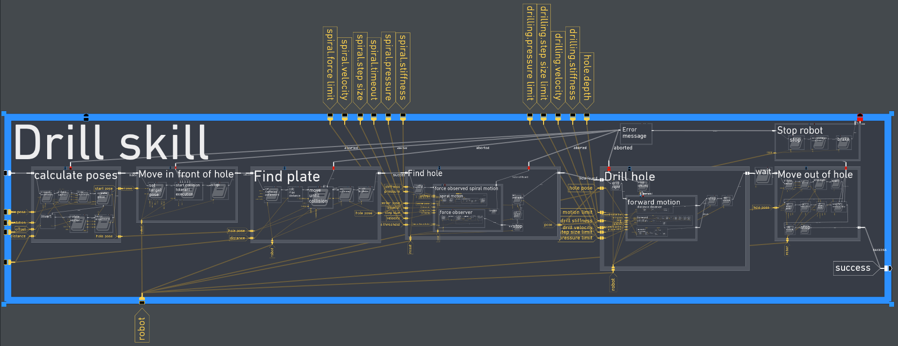

This page is intended as collaborative editor for the content of the
`RAFCON <RAFCON>`__ homepage. Until we have created a public GitHub
page, it will be located on the DLR homepage and can be reached at
http://rmc.dlr.de/rafcon. For inspiration, how the page could look like
or what markup one can use, see
`:Category:Website <:Category:Website>`__.

German
======

Teaser
------

.. figure:: Preview_RAFCON_for_website.png
   :alt: Preview RAFCON for website
   :scale: 30 %
   :align: left

\ **RAFCON: visuelle Programmierung von Zustandsmaschinen**\ 

RAFCON ist ein Werkzeug, mit dem hierarchisch aufgebaute
Zustandsmaschinen visuell programmiert werden können. Es ist konzipiert
für die Koordinierung von Abläufen komplexer Robotersysteme, wie z. B.
der Missionssteuerung. Die funktionsreiche GUI und ausgereifte
Debugwerkzeuge erlauben eine schnelle und intuitive Entwicklung von
Abläufen.

.. raw:: mediawiki

   {{clear}}

Single page
-----------

.. figure:: Preview_RAFCON_for_website.png
   :alt: Screenshot einer beispielhaften RAFCON Zustandsmaschine
   :scale: 30 %
   :align: left

\ **RAFCON**\ 

RAFCON (*RMC advanced flow control*) ist ein Softwarewerkzeug, das es
ermöglicht, hierarchische Zustandsmaschinen (engl. "state machines") mit
Hilfe einer funktionsreichen grafischen Benutzeroberfläche (GUI) visuell
zu programmieren. Es ist mit der Interpretersprache Python programmiert.
Da diese nicht kompiliert werden muss, können Zustandsmaschinen sogar
während ihrer Ausführung modifiziert werden. Darüber hinaus erleichtert
Python die Integration verschiedener, heterogener Komponenten eines
robotischen Systems, die in verschieden Sprachen geschrieben sein
können. Die neuartige Visualisierung von hierarchischen
Zustandsmaschinen im Zusammenspiel mit ausgereiften Debugwerkzeugen
ermöglicht es, Ideen schnell umzusetzen und zu testen, ohne dass
tiefgehende Programmierkenntnisse nötig sind. RAFCON unterstützt die
kollaborative Entwicklung von einzelnen Zustandsmaschinen. Während des
SpaceBotCamp Wettbewerbs
(http://www.dlr.de/rmc/rm/de/desktopdefault.aspx/tabid-10781/18794\_read-43643/)
wurde die Funktionstüchtigkeit unseres Softwarewerkzeugs unter Beweis
gestellt.

\ **Kern**\ 

Der Kern von RAFCON, das Konzept der Zustandsmaschine, ist getrennt von
der grafischen Darstellung. Die Programmierschnittstelle (API) kann
somit zur programmatischen Erstellung von Zustandsmaschinen benutzt
werden. Diese Zustandsmaschinen können hierarchisch organisiert sein und
Nebenläufigkeiten enthalten. Mittels eines Bibliothekskonzepts für
Zustände können einmal erstellte Zustandsmaschinen in anderen Abläufen
wiederverwendet werden. Der Datenfluss innerhalb einer Zustandsmaschine
ist dabei durch Datenports und Datenflüsse explizit definiert. Darüber
hinaus ist die Ausführung sehr flexibel: (Rückwärts-)Schritte, Pausen,
Sprünge und weitere Eingriffsmöglichkeiten werden unterstützt.

\ **Grafische Benutzeroberfläche (GUI)**\ 

Die GUI von RAFCON erlaubt (neben der API) die komplette Erstellung und
Modifikation von Zustandsmaschinen von Hand. Dies ist ein großer Vorteil
gegenüber z. B. SMACH. Die Bearbeitungshistorie ermöglicht es, in der
Zeit zurückzugehen, wenn Fehler gemacht wurden. Darüber hinaus kann die
Oberfläche zum Debuggen einer Zustandsmaschine genutzt werden, etwa mit
Hilfe der Ausführungshistorie und der Logbuchausgabe. Der grafische
Editor zeigt verschachtelte Zustände kleiner als ihre übergeordneten
Zustände. Damit werden unwichtige Details ausgeblendet, die jedoch jeder
Zeit über intuitive Navigationsmechanismen, wie Zoomen und Verschieben
wieder hervorgeholt werden können.

\ **Open Source**\ 

Wir planen RAFCON unter einer Open Source Lizenz auf GitHub zu
veröffentlichen. Zurzeit beheben wir noch kritische Fehler, verbessern
die Dokumentation und diskutieren ein geeignetes Lizenzmodell.

   {{clear}}

English
=======

Teaser
------

.. figure:: Preview_RAFCON_for_website.png
   :alt: Preview RAFCON for website
   :scale: 30 %
   :align: left

\ **RAFCON: visual state machine programming**\ 

RAFCON is a tool for visual programming of hierarchical state machines.
It is intended for the coordination of the task-flow of complex robotic
systems, e.g. for mission control. Its feature-rich GUI and
sophisticated debugging mechanisms permit fast prototyping and intuitive
task development.

.. raw:: mediawiki

   {{clear}}

Single page
-----------

.. figure:: Preview_RAFCON_for_website.png
   :alt: Screenshot of RAFCON with an example state machine
   :scale: 30 %
   :align: left

\ **RAFCON**\ 

RAFCON (*RMC advanced flow control*) is a software tool that allows for
visual programming of hierarchical state machines, using a feature-rich
graphical user interface (GUI). It is programmed in Python, which is an
interpreted language that relieves one from compiling and makes it
possible to alter a state machine, even while it is running. Python
eases the integration of heterogeneous components of a robotic system
written in different languages. The novel visualization of hierarchical
state machines together with sophisticated debugging mechanisms permit
fast prototyping and intuitive task development with closed loop system
tests, without the need of deep programming skills. The architecture
enables the collaboration in a team on a single state machine. We proved
all this during the SpaceBotCamp
(http://www.dlr.de/rmc/rm/en/desktopdefault.aspx/tabid-10781/18794\_read-43643/)
competition.

\ **Core**\ 

The core of RAFCON, its state machine concept, is separated from the
GUI. Its API can be used for the programmatic creation of state
machines. These state machines can be hierarchically organized and allow
for concurrency. With libraries, state machines can be reused in other
task flows. The data flow is explicitly defined using data ports and
their interconnections. Also, the execution is flexible:
(back-)stepping, pausing, jumping and more is possible.

\ **GUI**\ 

The RAFCON GUI allows to fully create and modify state machines. This is
a big advantage to SMACH, for example. The modification history enables
you to go back in time if errors were made. Furthermore, the user
interface can be used to debug a state machine e.g. by using the
execution history and the logging view. The graphical editor shows
nested states smaller than their parents. Thus, unimportant details are
hidden but can be accessed anytime by intuitive navigation mechanisms
like zooming and panning.

\ **Open source**\ 

We plan to release RAFCON as open source software on GitHub. Currently,
we are trying to fix the most critical issues, improve the documentation
and think about the right license.

